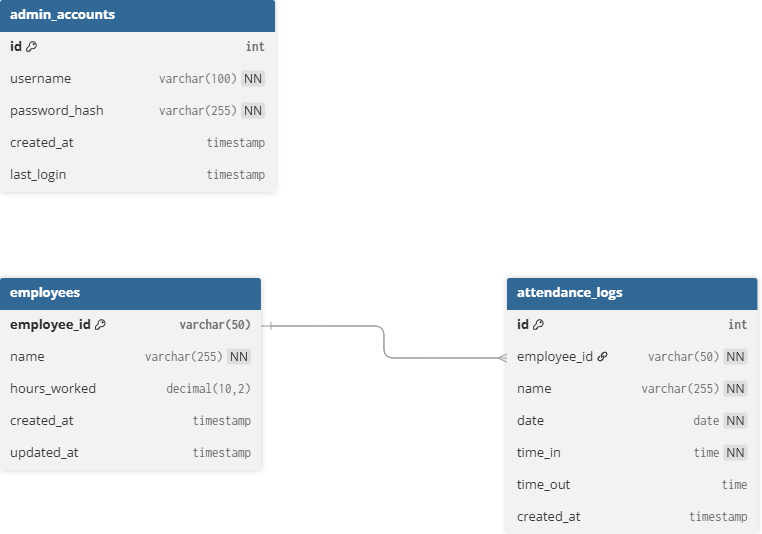

# Dochazka pro firmu - Company Attendance System
The commits are broken because I was dealing with an ownership issue (they were committed with a different email and Git didn’t like it), so I reset the HEAD.
## Project Structure

```
├── web/                              # Web-accessible files
│   ├── scripts/                      # PHP utility scripts
│   │   ├── config.php                # Centralized database & config
│   │   ├── csrf.php                  # CSRF token handling
│   │   └── migrate_db.php            # Database migration script
│   │
│   ├── styles.css                    # Unified stylesheet
│   ├── index.html                    # Home page
│   ├── zaznamenat.html               # Redirect to zaznamenat.php
│   ├── login.html                    # Legacy login page
│   ├── admin-login.html              # Redirect to login form
│   │
│   ├── zaznamenat.php                # Attendance entry processing
│   ├── zobrazit.php                  # Attendance view with pagination
│   ├── admin-login-form.php          # Admin login form (secure)
│   ├── admin-dashboard.php           # Admin dashboard with tabs
│   ├── admin-login.php               # Legacy redirect (backward compatibility)
│   ├── execute.php                   # Whitelisted SQL execution
│   └── logout.php                    # Secure logout
│
├── deploy/                           # Deployment configuration
│   └── apache.conf                   # Apache web server configuration
│
├── .github/                          # GitHub configuration
│   └── workflows/
│       └── deploy.yaml               # CI/CD deployment pipeline (Raspberry Pi)
│
├── .env                              # Database configuration (copy of .env.example)
├── .gitignore                        # Git ignore rules
└── README.md                         # This file
```

## Setup Instructions

### 1. Create .env File

Create a `.env` file in the project root (same level as the `web/` folder):

```
DB_SERVERNAME=localhost
DB_USERNAME=root
DB_PASSWORD=yourpassword
DB_NAME=company_attendance
```

### 2. Web Server Configuration

Point your web server's document root to the `web/` directory.

**PHP Development Server:**
```bash
cd web
php -S localhost:8000
```

Then visit `http://localhost:8000`

**Apache:**
Create `.htaccess` in project root to rewrite to web folder, or point DocumentRoot directly to web folder.

### 3. Database Setup

Run the database migration script to create the required tables:

```bash
cd web/scripts
php migrate_db.php
```

This will create three tables:
- `employees` - Employee management
- `attendance_logs` - Attendance records
- `admin_accounts` - Admin authentication

**Note:** The migration script will automatically migrate any existing data from the old `testovaqi_table` to the new `attendance_logs` table.

### Database Migration

If upgrading from a previous version, run the migration script to restructure the database:

```bash
cd web/scripts
php migrate_db.php
```

This will:
- Create the new `employees`, `attendance_logs`, and `admin_accounts` tables
- Migrate existing attendance data to `attendance_logs`
- Create a default admin account (admin/admin123)
- Preserve all existing functionality

### 4. Web Server Configuration

**Apache:**
See `deploy/apache.conf` for the recommended Apache configuration. Point your DocumentRoot to the `web/` directory.

# Example .env

```
DB_SERVERNAME=localhost
DB_USERNAME=root
DB_PASSWORD=yourpassword
DB_NAME=company_attendance
```

## Admin Access
1. Click "Administrace" on home page
2. Login with default credentials:
   - Username: `admin`
   - Password: `admin123`
3. The admin dashboard provides three tabs:
   - **Employees**: Manage employee records and hours worked
   - **Attendance Logs**: View and edit attendance records
   - **Admin Accounts**: Create and manage admin users

**Note:** Additional admin accounts can be created through the Admin Accounts tab in the dashboard.

## Database Schema

### employees
```sql
CREATE TABLE employees (
    employee_id VARCHAR(50) PRIMARY KEY,
    name VARCHAR(255) NOT NULL,
    hours_worked DECIMAL(10,2) DEFAULT 0.00,
    created_at TIMESTAMP DEFAULT CURRENT_TIMESTAMP,
    updated_at TIMESTAMP DEFAULT CURRENT_TIMESTAMP ON UPDATE CURRENT_TIMESTAMP
);
```

### attendance_logs
```sql
CREATE TABLE attendance_logs (
    id INT AUTO_INCREMENT PRIMARY KEY,
    employee_id VARCHAR(50) NOT NULL,
    name VARCHAR(255) NOT NULL,
    date DATE NOT NULL,
    time_in TIME NOT NULL,
    time_out TIME NULL,
    created_at TIMESTAMP DEFAULT CURRENT_TIMESTAMP,
    INDEX idx_employee_date (employee_id, date),
    INDEX idx_date (date)
);
```

### admin_accounts
```sql
CREATE TABLE admin_accounts (
    id INT AUTO_INCREMENT PRIMARY KEY,
    username VARCHAR(100) UNIQUE NOT NULL,
    password_hash VARCHAR(255) NOT NULL,
    created_at TIMESTAMP DEFAULT CURRENT_TIMESTAMP,
    last_login TIMESTAMP NULL
);
```
